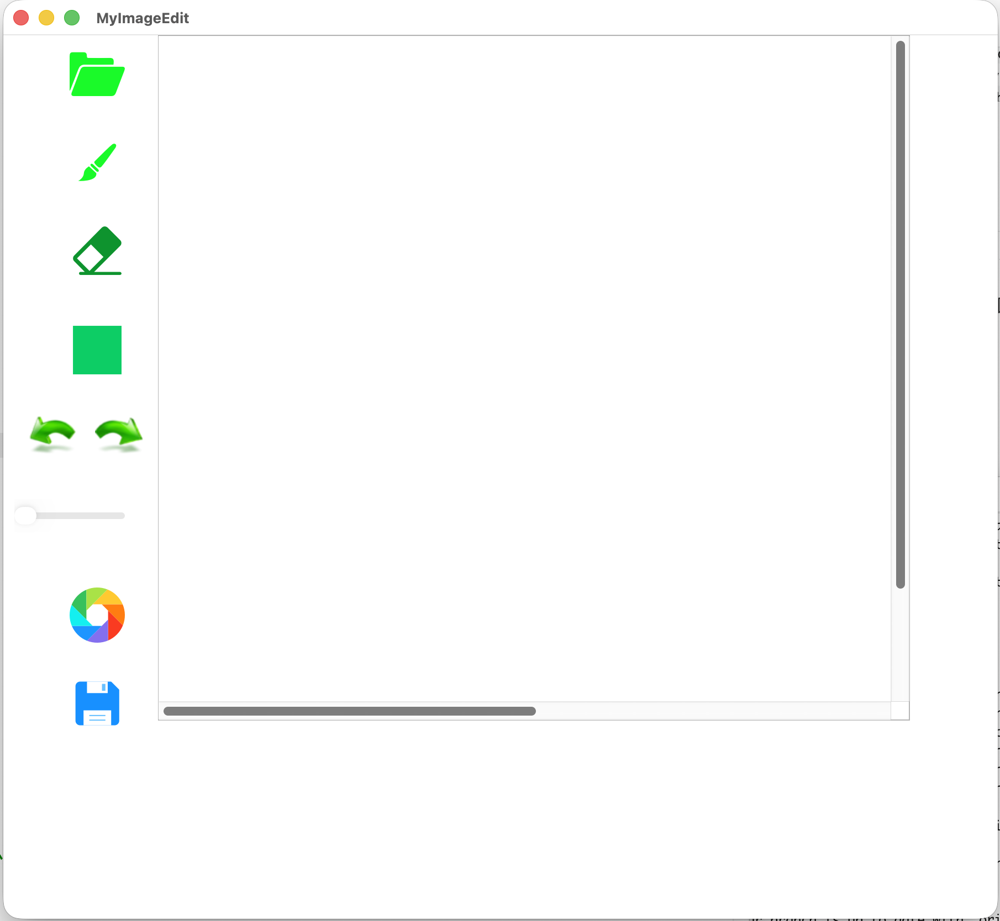

# 说明 

图片编辑器功能实现：

- 打开保存图片
- 画线
- 橡皮擦
- 画矩阵
- 易于扩展（添加功能，比如画圆形）
- 模块易替换（如将Qt替换为MFC）
- 用户接口简洁（封装）

使用模式设计MVC模式：

- Mode （模型）：数据逻辑
- View（视图）：数据显示
- Controller（控制器）：用户交互的部分

用到的设计模式：

- singleton单例模式：唯一的构建者控制器工厂
- facade门面（外观）模式：控制器对外
- 抽象工厂模式：创建MVC
- observer观察者模式：V和M通信

# V1版本 

第一个初始版本

 

代码可以继续优化的方向：

## 内存管理与现代C++ 

全面拥抱C++17， `CMakeLists.txt`已经非常标准地设置了 `set(CMAKE_CXX_STANDARD 17)`，但在核心代码中仍然大量使用了传统的裸指针和手动管理生命周期的方法，这在现代 `C++ `开发中存在较高的内存泄漏风险。

## 引入标准布局管理器 (Layouts)

在 `myimageedit.cpp `中，`UI` 控件仍使用绝对坐标（如 `setGeometry(QRect(50, 90, 70, 50))`）。虽然我们之前重写了 `resizeEvent` 来动态调整画布大小，但左侧工具栏仍然是“死”的。 优化方案：引入 `Qt `的 `QHBoxLayout `和 `QVBoxLayout`。

## 渲染管线的性能优化 (双缓冲与脏矩形) 

虽然目前的 `paintEvent `挥发渲染能够解决残影问题，但如果未来要处理高分辨率图像，每次鼠标移动都触发全图重绘会导致 CPU 飙升。

## 工程化与规范化建设 

一个成熟的项目不仅在于代码本身，还在于它的工程化程度。如引入规范的 `Doxygen `格式注释。