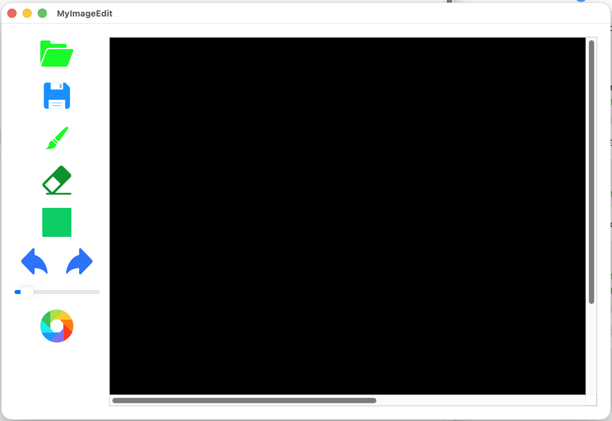

# XImageEdit

**English** | [中文](README.md)

A cross-platform image editor built with **Qt6 + C++17**, featuring MVC architecture and multiple design patterns. Supports macOS and Windows.

 

------

## Features

| Feature     | Description                                       |
| ----------- | ------------------------------------------------- |
| Open / Save | Supports PNG, JPG, BMP formats                    |
| Pen         | Freehand drawing with adjustable size and color   |
| Eraser      | Partial erase that restores original image pixels |
| Rectangle   | Draw rectangle outlines by dragging               |
| Undo / Redo | Multi-step history based on a command queue       |

------

## Architecture

The project follows the MVC pattern with clear separation of concerns. Each layer can be replaced independently — for example, swapping Qt for MFC only requires reimplementing `IView`.

```
┌──────────────────────────────────────────────┐
│  View                                         │
│  MyImageEdit (main window)                    │
│  XImage (canvas QWidget)                      │
│  XEditView (IView impl, double-buffer render) │
└────────────────────┬─────────────────────────┘
                     │ IController (Facade)
┌────────────────────▼─────────────────────────┐
│  Controller                                   │
│  IController — unified external interface     │
│  XControllerFactory — abstract factory        │
└────────────────────┬─────────────────────────┘
                     │ Observer notification
┌────────────────────▼─────────────────────────┐
│  Model                                        │
│  XModel (XSubject) — coordinates & params     │
│  IGraph strategy family:                      │
│    XPenGraph / XEraseGraph /                  │
│    XRectGraph / XImageGraph                   │
└──────────────────────────────────────────────┘
```

**Design patterns used:**

- **Abstract Factory**: `IControllerFactory` / `XControllerFactory` create M, V, C uniformly
- **Singleton**: `XEditView` and `XControllerFactory` guarantee a single global instance
- **Facade**: `IController` exposes a clean interface, hiding internal MVC coordination
- **Observer**: `XModel` (Subject) notifies `XEditView` (Observer) to trigger repaints
- **Strategy**: The `IGraph` family selects the correct drawing algorithm at runtime based on the active tool

------

## Requirements

- CMake ≥ 3.16
- Qt 6.x (Widgets module)
- C++17-compatible compiler (Clang / GCC / MSVC)
- clang-format (optional, for code formatting)

------

## Build & Run

```bash
# Remove old build cache
rm -rf build

# Configure
cmake -B build

# Build (8 threads)
cmake --build build -j8

# Format code (optional)
cmake --build build --target format

# Run
# macOS
open build/MyImageEdit.app
# Windows
.\build\MyImageEdit.exe
```

------

## Extension Guide

**Adding a new drawing tool (circle as an example):**

1. Add `XCIRCLE` to the `XSTATUS` enum in `constants.h`
2. Create `include/xcirclegraph.h` and `src/xcirclegraph.cpp`, inheriting `IGraph` and implementing `Draw()`
3. Register in the `XEditView` constructor: `views[XCIRCLE] = new XCircleGraph()`
4. Add a `SetCircle()` slot in `XImage` and connect it to the corresponding button

No other code changes are required.

------

## License

MIT License